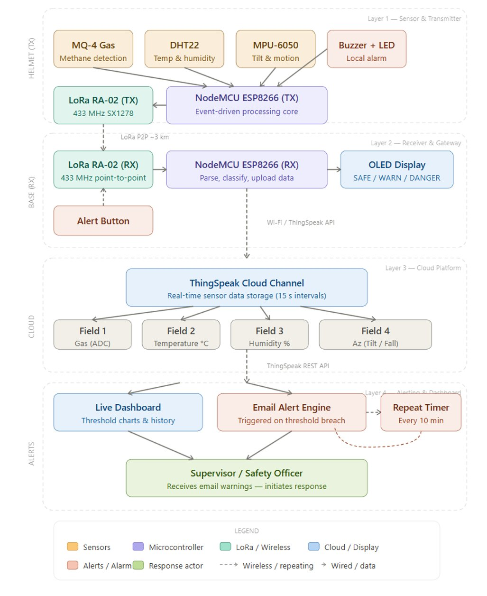
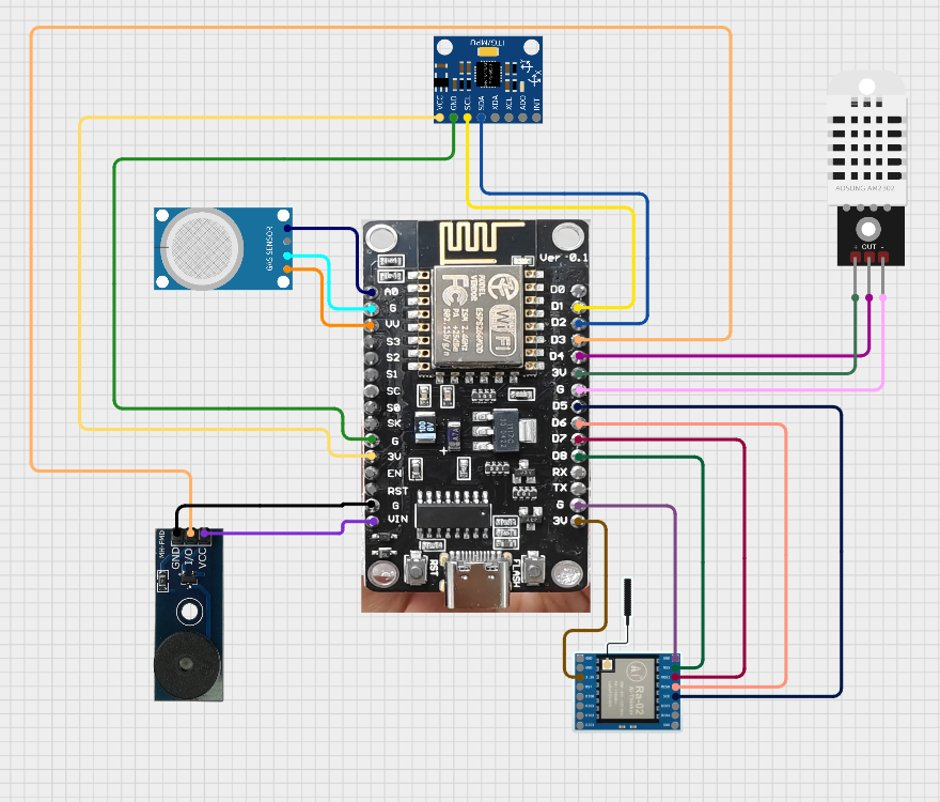
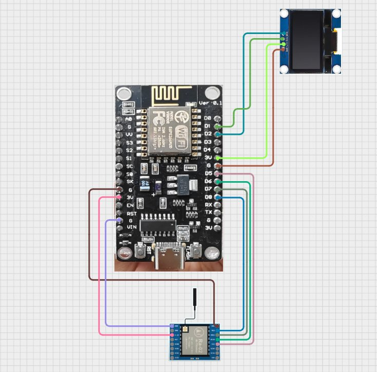
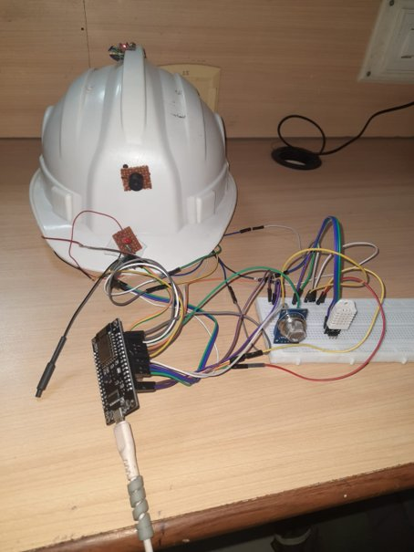
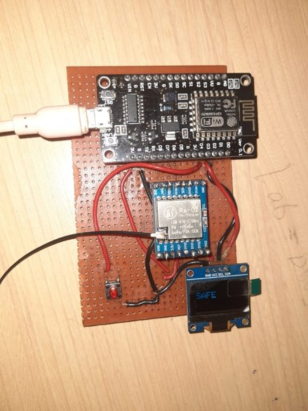
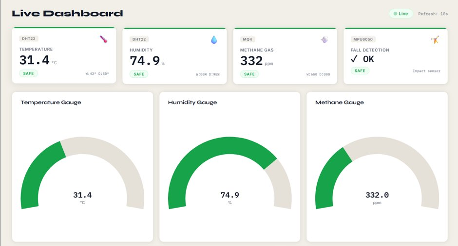
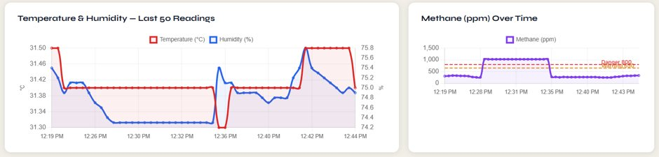
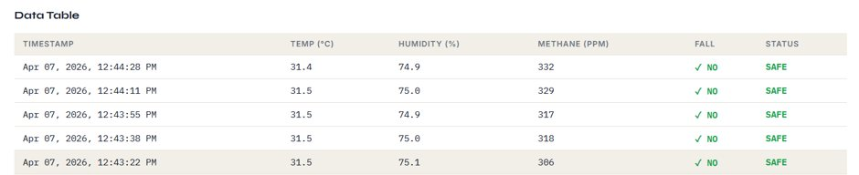
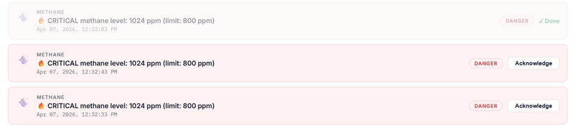
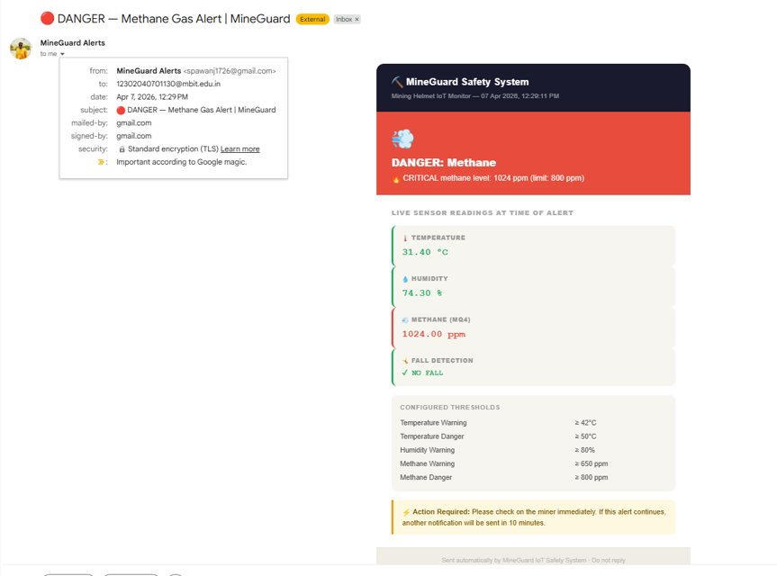

# 🪖 MineGUARD — Smart Safety Helmet for Underground Mining

> IoT-based wearable safety system for real-time hazard detection, LoRa P2P communication, and cloud monitoring via ThingSpeak.

**Institution:** Madhuben & Bhanubhai Patel Institute of Technology (MBIT), CVM University  
**Course:** Industry 4.0 and IIoT (202170601)  
**Team:** Krish Kushvaha · Pawan Sharma · Poojan Mistry  
**Guide:** Prof. Tejal Tandel

---

## 🎬 Hardware Demo

[](https://youtu.be/66I_Y6gJ6wc?si=Xl-IWTM00FsUMlOe)

> Click the thumbnail above to watch the live hardware demonstration on YouTube.

---

## 📋 Table of Contents

- [System Overview](#system-overview)
- [System Architecture](#system-architecture)
- [Hardware Requirements](#hardware-requirements)
- [Wiring & Connections](#wiring--connections)
- [Hardware Build Photos](#hardware-build-photos)
- [Arduino IDE Setup](#arduino-ide-setup)
- [Library Installation](#library-installation)
- [Transmitter (Helmet) Code Setup](#transmitter-helmet-code-setup)
- [Receiver (Base Station) Code Setup](#receiver-base-station-code-setup)
- [ThingSpeak Cloud Setup](#thingspeak-cloud-setup)
- [Live Dashboard](#live-dashboard)
- [Alert Thresholds Reference](#alert-thresholds-reference)
- [Challenges Faced](#challenges-faced)

---

## System Overview

MineGUARD is a two-node IoT system:

| Node | Role | Key Components |
|---|---|---|
| **Helmet (TX)** | Sense → Alert → Transmit | ESP8266 + MQ-4 + DHT22 + MPU-6050 + LoRa SX1278 + Buzzer |
| **Base Station (RX)** | Receive → Display → Upload | ESP8266 + LoRa SX1278 + OLED SSD1306 + Alert Button + Wi-Fi |

Data flows from the helmet underground to the surface base station over **433 MHz LoRa P2P** (up to 3 km range through rock), then up to the **ThingSpeak cloud** for dashboard visualization and automated email alerts.

---

## System Architecture



The system is structured into four hierarchical layers:

| Layer | Name | Function |
|---|---|---|
| **Layer 1** | Helmet Sensor & Transmitter | Reads sensors, evaluates thresholds, triggers local buzzer/LED, transmits LoRa packets |
| **Layer 2** | Base Station Receiver & Gateway | Receives LoRa packets, displays status on OLED, uploads to ThingSpeak via Wi-Fi |
| **Layer 3** | ThingSpeak Cloud Platform | Stores sensor data, hosts live charts, exposes REST API |
| **Layer 4** | Alerting & Supervisor Dashboard | Email alerts on threshold breach, 10-min repeat, supervisor response |

---

## Hardware Requirements

### Both Nodes (×2 each)

| Component | Model | Purpose |
|---|---|---|
| Microcontroller | NodeMCU ESP8266 | Central processing unit |
| LoRa Transceiver | SX1278 RA-02 (433 MHz) | Long-range wireless communication |

### Helmet (Transmitter) Node Only

| Component | Model | Purpose |
|---|---|---|
| Gas Sensor | MQ-4 | Methane / combustible gas detection (A0) |
| Temp & Humidity | DHT22 (AM2302) | Environmental monitoring (D4) |
| IMU | MPU-6050 | Fall & tilt detection via I2C |
| Buzzer | 5V Active Piezoelectric | Local audible alarm |
| Power | 18650 Li-Ion 3000mAh + TP4056 | 48–72 hr battery operation |

### Base Station (Receiver) Node Only

| Component | Model | Purpose |
|---|---|---|
| OLED Display | SSD1306 128×64 | Shows SAFE / WARN / DANGER status |
| Push Button | Tactile button | Sends STAY ALERT back to helmet |
| Wi-Fi | ESP8266 built-in | Uploads data to ThingSpeak cloud |

---

## Wiring & Connections

### Transmitter (Helmet) Node — Full Circuit



> **Components visible:** NodeMCU ESP8266 (centre) · MPU-6050 (top) · DHT22/AM2302 (right) · MQ-4 Gas Sensor (left) · Buzzer module (bottom-left) · SX1278 LoRa RA-02 (bottom-right)

#### MQ-4 Gas Sensor → NodeMCU

| MQ-4 Pin | NodeMCU Pin | Wire Colour |
|---|---|---|
| VCC | Vin (5V) | Red / Orange |
| GND | GND | Sky blue |
| AOUT | A0 | Dark Blue |

#### DHT22 (AM2302) → NodeMCU

| DHT22 Pin | NodeMCU Pin | Wire Colour |
|---|---|---|
| VCC | 3V | Green |
| GND | GND | Pink |
| DATA | D4 | Purple / Pink |

#### MPU-6050 → NodeMCU (I2C)

| MPU-6050 Pin | NodeMCU Pin | Wire Colour |
|---|---|---|
| VCC | 3V | Yellow |
| GND | GND | Green |
| SDA | D2 | Blue |
| SCL | D1 | Yellow |

#### Buzzer Module → NodeMCU

| Buzzer Pin | NodeMCU Pin | Wire Colour |
|---|---|---|
| GND | GND | Black |
| I/O | D3 | Orange |
| VCC | 3V / Vin | Purple |

#### SX1278 LoRa RA-02 → NodeMCU (SPI)

| LoRa Pin | NodeMCU Pin | Wire Colour |
|---|---|---|
| VCC | 3V | Brown |
| GND | GND | Purple |
| SCK | D5 | Green |
| MISO | D6 | Teal |
| MOSI | D7 | Blue |
| NSS/CS | D8 | Brown/Gold |
| RST | Not connected | — |
| DIO0 | Not connected | — |

---

### Receiver (Base Station) Node — Full Circuit



> **Components visible:** NodeMCU ESP8266 (centre) · SSD1306 OLED display (top-right) · SX1278 LoRa RA-02 (bottom)

#### OLED SSD1306 → NodeMCU (I2C)

| OLED Pin | NodeMCU Pin | Wire Colour |
|---|---|---|
| VCC | 3V | Red |
| GND | GND | Black |
| SDA | D2 | Teal |
| SCL | D1 | Green |

#### SX1278 LoRa RA-02 → NodeMCU (SPI)

| LoRa Pin | NodeMCU Pin | Wire Colour |
|---|---|---|
| VCC | 3V | Red |
| GND | GND | Black |
| SCK | D5 | Blue |
| MISO | D6 | Pink |
| MOSI | D7 | Dark Red |
| NSS/CS | D8 | Brown |
| RST | Not connected | — |
| DIO0 | Not connected | — |

#### Alert Button → NodeMCU

| Button Pin | NodeMCU Pin |
|---|---|
| One leg | D3 |
| Other leg | GND |

> Code uses `INPUT_PULLUP` — no external resistor needed.

---

## Hardware Build Photos

### Transmitter — Helmet Assembly



The NodeMCU, MQ-4, DHT22, and MPU-6050 are mounted on a breadboard alongside the safety helmet. The LoRa antenna is visible extending from the RA-02 module. Sensors connect via jumper wires to the ESP8266 on a perforated board attached below the helmet brim.

---

### Receiver — Base Station Assembly



The base station is built on a perf board with the NodeMCU at the top, the RA-02 LoRa module in the centre, the alert button (red) on the left, and the SSD1306 OLED display (showing **SAFE**) at the bottom-right. Powered via USB.

---

## Arduino IDE Setup

### 1. Install Arduino IDE
Download Arduino IDE 2.x from [arduino.cc/en/software](https://www.arduino.cc/en/software).

### 2. Add ESP8266 Board Support

1. Open Arduino IDE → **File → Preferences**
2. In **Additional Boards Manager URLs**, paste:
   ```
   http://arduino.esp8266.com/stable/package_esp8266com_index.json
   ```
3. Go to **Tools → Board → Boards Manager**
4. Search `esp8266` → Install **ESP8266 by ESP8266 Community**

### 3. Select Board & Port

| Setting | Value |
|---|---|
| Board | `NodeMCU 1.0 (ESP-12E Module)` |
| Upload Speed | `115200` |
| Port | Your COM / tty port |

---

## Library Installation

Go to **Tools → Manage Libraries** and install all of the following:

| Library Name | Author | Purpose |
|---|---|---|
| `LoRa` | Sandeep Mistry | SX1278 LoRa communication |
| `DHT sensor library` | Adafruit | DHT22 temp & humidity |
| `Adafruit Unified Sensor` | Adafruit | Dependency for DHT library |
| `Adafruit SSD1306` | Adafruit | OLED display driver |
| `Adafruit GFX Library` | Adafruit | Graphics primitives for OLED |
| `Adafruit BusIO` | Adafruit | I2C / SPI bus dependency |
| `ThingSpeak` | MathWorks | Cloud data upload |

> `Wire.h` and `SPI.h` are part of the ESP8266 core — no separate install needed.

---

## Transmitter (Helmet) Code Setup

Open `transmitter.ino`. Verify pin definitions match your wiring:

```cpp
#define LED_PIN   D0   // Status LED
#define DHTPIN    D4   // DHT22 data pin
#define DHTTYPE   DHT11 // Change to DHT22 if using AM2302
#define SS        D8   // LoRa chip select
#define BUZZER    D3   // Active buzzer
// MPU-6050 I2C → Wire.begin(D2, D1)  [SDA=D2, SCL=D1]
```

No Wi-Fi credentials required on the transmitter. Flash and open **Serial Monitor at 9600 baud** — expected output:

```
🔥 TX READY 🔥
----------------------------
STATUS: SAFE ✓
Temp: 31.50
Hum: 74.90
Gas: 332
Z: 0.98
----------------------------
📡 Sent: 332,31.5,74.9,0.98
```

The transmitter packet format is: `gas,temperature,humidity,Az`

---

## Receiver (Base Station) Code Setup

Open `receiver.ino` and update credentials:

```cpp
// -------- Wi-Fi --------
const char* ssid     = "YOUR_WIFI_SSID";
const char* password = "YOUR_WIFI_PASSWORD";

// -------- ThingSpeak --------
unsigned long channelNumber = YOUR_CHANNEL_NUMBER;
const char* writeAPIKey     = "YOUR_WRITE_API_KEY";
```

Flash and open **Serial Monitor at 9600 baud** — expected output:

```
🔥 RX READY 🔥
----------------------------
STATUS: SAFE ✓
Temp: 31.50
Hum: 74.90
Gas: 332
Z: 0.98
----------------------------
☁️ Uploaded to ThingSpeak
```

The OLED will display `SAFE`, `WARN`, or `DANGER` on every received packet.

### Alert Button
Press the button on **D3** → base station broadcasts `STAY ALERT` three times via LoRa → helmet buzzer activates for **5 seconds**.

---

## ThingSpeak Cloud Setup

### 1. Create Account & Channel

1. Sign up at [thingspeak.com](https://thingspeak.com)
2. Click **New Channel** and configure fields:

| Field | Label | Data |
|---|---|---|
| Field 1 | Gas (ADC) | Raw MQ-4 ADC value (0–1023) |
| Field 2 | Temperature (°C) | DHT22 float |
| Field 3 | Humidity (%) | DHT22 float |
| Field 4 | Az — Tilt/Fall (g) | MPU-6050 Z-axis (÷16384) |

3. Save the channel → copy the **Channel Number** and **Write API Key** into `receiver.ino`.

### 2. Data Upload Interval
The receiver uploads every **15 seconds** (`millis() - lastTS > 15000`). This matches ThingSpeak's free-tier minimum update rate.

### 3. Email Alerts Setup
1. Go to **Apps → ThingHTTP** → create a new HTTP action pointing to your email endpoint.
2. Go to **Apps → React** → trigger the ThingHTTP when:
   - Field 1 (Gas) exceeds `850`
   - Field 2 (Temperature) exceeds `55`
3. Set repeat condition: re-trigger **every 10 minutes** while the condition persists.

### 4. Downloading Data as CSV
ThingSpeak allows full data export as CSV for offline analysis:

1. Open your channel page on ThingSpeak
2. Click the **Data Export** tab (or use the API URL below)
3. Download all data:
   ```
   https://api.thingspeak.com/channels/YOUR_CHANNEL_ID/feeds.csv?api_key=YOUR_READ_API_KEY
   ```
4. Download a specific field:
   ```
   https://api.thingspeak.com/channels/YOUR_CHANNEL_ID/fields/1.csv?api_key=YOUR_READ_API_KEY&results=1000
   ```
5. Limit by date range (optional):
   ```
   https://api.thingspeak.com/channels/YOUR_CHANNEL_ID/feeds.csv?start=2026-04-01%2000:00:00&end=2026-04-07%2023:59:59
   ```

> The exported CSV contains columns: `created_at`, `entry_id`, `field1` (Gas), `field2` (Temp), `field3` (Humidity), `field4` (Az). It can be opened directly in Excel, Google Sheets, or imported into MATLAB for analysis.

---

## Live Dashboard

The MineGUARD ThingSpeak dashboard provides real-time visibility into all sensor readings with automatic refresh every 10 seconds.

### Status Cards & Gauges



The top row shows four live status cards:

| Card | Sensor | Displays | Status Indicator |
|---|---|---|---|
| **TEMPERATURE** | DHT22 | Value in °C | SAFE / WARNING / DANGER |
| **HUMIDITY** | DHT22 | Value in % | SAFE / WARNING / DANGER |
| **METHANE GAS** | MQ-4 | Value in ppm | SAFE / WARNING / DANGER |
| **FALL DETECTION** | MPU-6050 | OK / FALL | SAFE / DANGER |

Below the cards, three arc gauges provide at-a-glance readings for Temperature, Humidity, and Methane. The gauge arc fills green in the safe zone and shifts toward red as values approach danger thresholds.

---

### Time-Series Charts



Two live charts update with every data upload:

- **Temperature & Humidity (Last 50 Readings):** Dual-axis line chart — Temperature (°C) in red on the left axis, Humidity (%) in blue on the right axis. Allows immediate visual correlation between the two environmental parameters.
- **Methane (ppm) Over Time:** Single-axis line chart for the MQ-4 ADC reading. A horizontal dashed red line marks the **Danger threshold (800 ppm)** and a dashed orange line marks the **Warning threshold (650 ppm)**, making threshold breaches instantly visible.

---

### Data Table & Continuous Logs



The data table records every upload with a full timestamp and all sensor values in one row:

| Column | Description |
|---|---|
| **TIMESTAMP** | Date and time of each reading (e.g. Apr 07, 2026, 12:44:28 PM) |
| **TEMP (°C)** | Temperature reading from DHT22 |
| **HUMIDITY (%)** | Relative humidity reading from DHT22 |
| **METHANE (PPM)** | Gas level from MQ-4 sensor |
| **FALL** | Fall detection status from MPU-6050 (✓ NO / FALL) |
| **STATUS** | Computed overall status: **SAFE** / **WARNING** / **DANGER** |

This table is sortable and provides a running history of all readings — new rows appear at the top every 15 seconds. The entire log can be exported as CSV (see [Downloading Data as CSV](#4-downloading-data-as-csv)).

---

### Alert Logs



The alert log panel captures every threshold breach event with:

- **Event type** (e.g. METHANE)
- **Exact reading and limit** (e.g. *Critical methane level: 1024 ppm — limit: 800 ppm*)
- **Timestamp** of when the breach occurred
- **Severity badge** (DANGER in red)
- **Acknowledge button** — allows the safety officer to mark an alert as reviewed; acknowledged alerts show **✓ Done**

Unacknowledged alerts remain highlighted in the log until manually reviewed, ensuring no critical event is overlooked.

---

### Email Alert



When a sensor value exceeds a DANGER threshold, the system automatically sends a formatted email to the configured supervisor address. The email includes:

- **Subject:** `🔴 DANGER — Methane Gas Alert | MineGUARD`
- **Alert type and reading** (e.g. Critical methane level: 1024 ppm, limit: 800 ppm)
- **Live sensor snapshot at time of alert** — Temperature, Humidity, Methane, Fall Detection
- **Configured threshold table** for quick reference
- **Action notice:** *"Please check on the miner immediately. If this alert continues, another notification will be sent in 10 minutes."*

If the hazardous condition persists, repeat emails are sent every **10 minutes** until readings return to safe levels, after which a normal-condition email confirms the environment is stable.

---

## Alert Thresholds Reference

### Transmitter Logic (Helmet)

| Parameter | WARNING | DANGER |
|---|---|---|
| Temperature | > 43°C | > 55°C |
| Humidity | > 65% RH | > 80% RH |
| Gas (ADC) | > 700 | > 850 |
| Tilt (Ax) | `abs(Ax) > 0.25 g` | — |
| Fall (Az) | — | `Az < 0.0 g` |

### Receiver Logic (Base Station)

| Parameter | WARNING | DANGER |
|---|---|---|
| Temperature | > 43°C | > 55°C |
| Humidity | > 65% RH | > 80% RH |
| Gas (ADC) | > 700 | > 850 |
| Az | `abs(Az) > 1.2 g` | `Az < 0.5 g` |

> ⚠️ The TX and RX use slightly different Az thresholds. Unify them in a shared constants header if inconsistency causes mismatched status readings.

---

## Tech Stack

| Layer | Technology |
|---|---|
| Firmware | Arduino C++ (Arduino IDE 2.x) |
| Microcontroller | ESP8266 NodeMCU |
| Wireless | LoRa SX1278 @ 433 MHz — Sandeep Mistry library |
| Sensing | MQ-4 (gas) · DHT22 (temp/humidity) · MPU-6050 (IMU) |
| Display | SSD1306 OLED — Adafruit GFX + SSD1306 library |
| Cloud | ThingSpeak by MathWorks |
| Alerting | ThingSpeak React + ThingHTTP (automated email) |
| Data Export | ThingSpeak REST API (CSV download) |
| Power | 18650 Li-Ion 3000mAh + TP4056 charge protection |

---

## Challenges Faced

### 1. LoRa Half-Duplex Timing Conflict
The SX1278 cannot transmit and receive simultaneously. The transmitter needed a dedicated **400 ms receive window** at the start of each loop to listen for incoming `STAY ALERT` commands before switching to transmit mode. Without this window, remote alerts from the base station were consistently missed.

### 2. SPI Bus Conflict Between LoRa and Other Peripherals
The ESP8266 shares a single SPI bus. `LoRa.idle()` with a 50 ms delay was required before every `beginPacket()` to avoid bus collisions that caused corrupted or dropped packets.

### 3. DHT11 vs DHT22 in Code
The project uses a DHT22 (AM2302) physically, but the firmware `#define DHTTYPE DHT11` must be corrected to `DHT22` to get accurate readings. The DHT22 supports −40–80°C vs the DHT11's 0–50°C limit, which matters given the 55°C DANGER threshold.

### 4. MQ-4 Raw ADC Calibration
Thresholds are in raw ADC units (700 WARNING / 850 DANGER) rather than calibrated ppm. The MQ-4 requires a 24–48 hour burn-in for a new sensor, and its output curve shifts with ambient temperature and humidity. Cold-start readings during early testing were unreliable for the first few minutes.

### 5. MPU-6050 Az Threshold Mismatch Between TX and RX
The transmitter triggers DANGER at `Az < 0.0 g`; the receiver uses `Az < 0.5 g`. This means the OLED status can disagree with the helmet buzzer. Both nodes should share a common threshold constant.

### 6. ThingSpeak 15-Second Rate Limit
The free ThingSpeak tier enforces a 15-second minimum upload interval. Since the helmet samples every ~1.2 seconds, the cloud dashboard lags real-time by up to 15 seconds — critical in a fast-developing gas leak scenario.

### 7. Wi-Fi Dependency at the Base Station
Without a Wi-Fi access point at the surface, no cloud data is uploaded and the supervisor is limited to what the OLED shows locally. A GSM/4G fallback module is needed for truly remote deployments.

### 8. No Deep Sleep on Transmitter
The transmitter runs a continuous `loop()` with no sleep mode, consuming full active power constantly. Interrupt-driven wake-on-threshold via ESP8266 deep sleep could reduce idle consumption by 60–80%, significantly extending battery life beyond the 48–72 hour target.

### 9. Single Helmet P2P Coverage
The transmitted packet (`gas,temp,hum,Az`) contains no device ID. Multiple helmets on the same frequency would collide. Migration to LoRaWAN with unique device EUIs is required for multi-miner deployments.

### 10. Helmet Form Factor & Wiring
Fitting the NodeMCU, LoRa module, MPU-6050, MQ-4, DHT22, buzzer, battery, and all wiring inside a standard safety helmet is physically constrained. The prototype used a perforated board and jumper wires. A custom PCB is recommended for any production version.

---

*MineGUARD — Built for MBIT CVM University, A.Y. 2025-2026*
